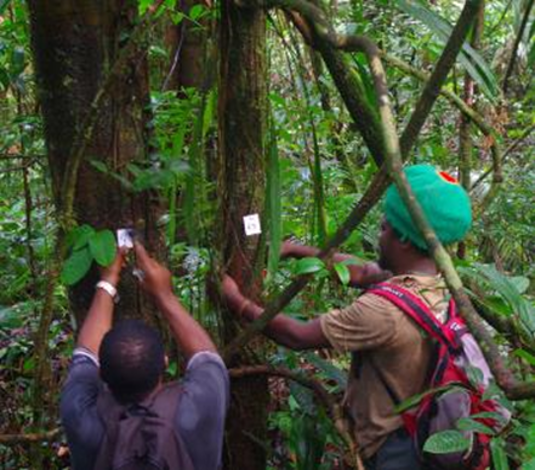
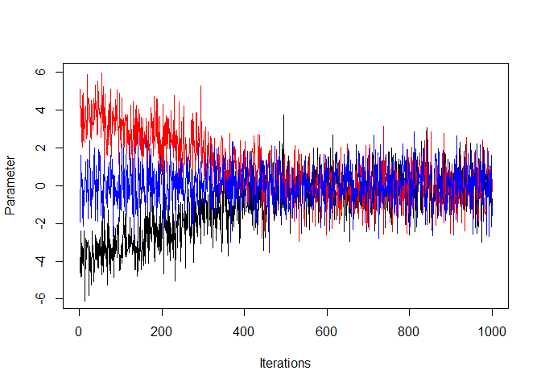

```{r}
#| echo: false
#| message: false
#| warning: false

library(ggplot2)
library(dplyr)
library(tidyr)
```

# Correlative models

::: notes
The objective of this first part of the presentation is to give a few concepts that related with things that you may already be familiar with

this is not exclusive to the context of bayesian modelling
:::

## Correlative *vs* process-based approaches

{fig-align="center"}

::: notes
-   process-based : biological and ecological processes explicitly simulated =\> attributes of the simulated ecosystem are emerging properties

-   correlative : test correlations between observations and explanatory variables, without assuming the underlying processes

=\> correlative more accurate in the given context =\> process-based more generalisable, as long as the realism of the simulations is evaluated

=\> 2 complementary approaches
:::

## A data-driven approach

:::::: columns
:::: {.column width="50%"}
::: nonincremental
-   Correlative models explain patterns observed in the data.

-   They use statistical methods to fit model parameters to the data.
:::
::::

::: {.column width="50%"}
{fig-align="center"}
:::
::::::

## Objectives of correlative models

::::: nonincremental
::: fragment
-   **Hypothesis testing**: identify factors associated with observed patterns

*Eg: Does tree growth decrease with drought?*
:::

::: fragment
-   **Prediction**: forecast responses under given conditions

*Eg: Predict tree growth under a given climate*
:::
:::::

::: fragment
⚠️ Predictions are reliable only if the model remains valid in the considered conditions.
:::

## Example of the linear model

$$y_i = \alpha + \beta \times x_i + \epsilon_i$$

:::::::: nonincremental
::::::: columns
:::: {.column width="50%"}
::: fragment
-   [y is the response variable]{style="font-size: 30px"}

-   [x is the explanatory variable]{style="font-size: 30px"}

-   [$\alpha$ is the **intercept** (the mean of Y when X = 0)]{style="font-size: 30px"}

-   [$\beta$ is the **slope** of the relationship between X and Y]{style="font-size: 30px"}

-   [$\epsilon_i$ is the **residual**. $\epsilon_i \sim \mathcal N(0, \sigma^2)$]{style="font-size: 30px"}
:::
::::

:::: {.column width="50%"}
::: fragment
[$\alpha$, $\beta$ and $\sigma$ are the **parameters** of the model]{style="font-size: 30px"}

[The model can also be written:]{style="font-size: 30px"}

$$y_i \sim \mathcal N(\alpha + \beta \times x_i,  \sigma^2)$$
:::
::::
:::::::
::::::::

::: notes
who want to write the equation of the model we want to fit on the blackboard?
:::

## Example of the linear model

$$y_i \sim \mathcal N(\alpha + \beta \times x_i,  \sigma^2)$$

[The model predicts a probability density of Y for any value of X normally distributed around the regression line.]{style="font-size: 30px"}

::::: columns
::: {.column width="50%"}
{width="200%"} [Source: [E. Marcon](https://ericmarcon.github.io/Cours-R-Geeft/Regression_lineaire.html#6)]{style="font-size: 22px"}
:::

::: {.column width="50%"}
-   [The mean value of Y for any value of X is the black line : $\mu = \alpha + \beta \times x$]{style="font-size: 25px"}

-   [The predicted probability density of Y are represented by the red dots: they are normally distributed around the mean with a variance $\sigma^2$]{style="font-size: 25px"}
:::
:::::

::: notes
read the fig as in 3D
:::

::: notes
for prediction : need to think of good validation of the model =\> ex for distribution model do spatial cross-validation

Be careful when applying the model to conditions outside of the range of calibration (eg for climate change)
:::

## What if the data are not normally distributed? {.smaller}

Some data are by nature not normally distributed, so we cannot model them with a normal distribution.

::: fragment
-   count data (*e.g.*: number of individuals of a species in a plot, number of birds heard in a given time) can be modelled with a **Poisson** distribution
:::

::: fragment
-   success/failure data (*e.g*: presence/absence of a species in a plot, proportion of tree browsed in a plot) can be modelled with a **binomial** distribution
:::

[To know more about these distributions: see the Wikipedia pages, and the [distribution zoo](https://ben18785.shinyapps.io/distribution-zoo/){preview-link="false"}.]{style="font-size: 25px"}

## Generalised linear models {.smaller}

<!-- Is this slide really needed ? -->

*Generalised linear models* (**GLM**) are an extension of linear models allowing different distributions of the response variable.

:::: nonincremental
::: fragment
[They have 3 component:]{style="font-size: 30px"}

-   [a **linear predictor**: a linear combination of explanatory variables]{style="font-size: 30px"}

-   [a **distribution** of individual responses around their mean]{style="font-size: 30px"}

-   [a **link function** between the predictor (defined on $\mathbb{R}$) and the mean response (not necessarily defined on $\mathbb{R}$)]{style="font-size: 30px"}

[In the linear model seen before, the distribution is *Normal* and the link function the *identity*.]{style="font-size: 25px"}
:::
::::

## What if the observations are not independent? {.smaller}

An linear regression assumes that all observations are **independent**.

When observations are grouped, they are not independent (*e.g.* several observations on a same site, on a same individual, in a same year...).

-   We can include the group as a categorical explanatory variable.
    This evaluate the effect of each group.

-   When the number of groups is too high and we are not interested in the effect of each group, we can use a **linear mixed model**, which is a simple form of **hierarchical model**.

## Hierarchical model {.smaller}

[Linear mixed models have a hierarchical structure.]{style="font-size: 30px"}

::: fragment
[One or more of their coefficients (the intercept or the response to explanatory variables) varies between groups *j*:]{style="font-size: 30px"}

$$y_{ij} \sim \mathcal N(\alpha_j + \beta \times x_{ij} ,  \sigma^2)$$
:::

::: fragment
[and this variation is modelled by a group-level distribution:]{style="font-size: 30px"}

$$\alpha_j \sim \mathcal N(\mu_{\alpha}, \sigma^2_{\alpha})$$

[The group-specific intercepts are not independent parameters: they are drawn from a common distribution.]{style="font-size: 30px"}

[*NB: here we represent the effect of the group only on the intercept, but we can include this effect on the other coefficients as well.*]{style="font-size: 22px"}
:::

## Hierarchical model

$$y_{ij} \sim \mathcal N(\alpha_j + \beta \times x_{ij} ,  \sigma^2)$$

$$\alpha_j \sim \mathcal N(\mu_{\alpha}, \sigma^2_{\alpha})$$

```{r}
#| echo: false
#| fig-align: center

# population parameters
beta0 <- 5
beta1 <- 1.2

# group intercepts around the population intercept
groups <- tibble(
  group = factor(1:6),
  alpha = beta0 + c(-2, -1, -0.5, 0.5, 1, 2)
)

# x grid
x <- seq(0, 10, length.out = 100)

# create regression lines
dat <- groups %>%
  crossing(x = x) %>%
  mutate(y = alpha + beta1 * x)

# plot
ggplot(dat, aes(x, y, color = group)) +
  geom_line(linewidth = 1.2) +
  
  # population regression
  geom_abline(
    intercept = beta0,
    slope = beta1,
    linetype = "dashed",
    linewidth = 1.4,
    color = "black"
  ) +
  
  # group intercepts on y-axis
  geom_point(
    data = groups,
    aes(x = 0, y = alpha),
    size = 3,
    show.legend = FALSE
  ) +
  
  labs(
    x = "Explanatory variable (x)",
    y = "Response (y)",
  ) +
  
  theme_minimal() +
  theme(legend.position = "none")
```

## Hierarchical model {.smaller}

More complex hierarchical models can include covariates in the group-level distribution:

$$y_{ij} \sim \mathcal N(\alpha_j + \beta \times x_{ij} ,  \sigma^2)$$

$$\alpha_j \sim \mathcal N(\alpha + \color{OrangeRed}{\beta_\alpha \times z_j}, \sigma^2_{\alpha})$$

:::: fragment
*Eg: the response (*$\boldsymbol{y_{ij}}$) of individual trees $\boldsymbol{i}$ belonging to species $\boldsymbol{j}$ can be modeled with a species-level parameter ($\boldsymbol{\alpha_j}$).

*These species-level parameters can then be modelled using functional traits (*$\boldsymbol{z_j}$).

::: nonincremental
-   $\boldsymbol{\alpha}$ is the overall (community-level) intercept

-   $\boldsymbol{\beta_\alpha}$ is the effect of the trait on the species intercept
:::
::::

# Bayesian framework

## Why a Bayesian approach?

<!-- to check and think about, why not bayesian computing costly ???-->

-   to quantify **uncertainty** (and propagagte it), as we get a full fistribution for each fitted parameters

-   to leverage **prior knowledge** (previous studies or expert knowledge)

-   for its **flexibility** (adapted to heterogeneous or uncomplete data, possible to fit complex models)

[*and why not a bayesian approach 🤨?* : more computationannly intensive]{.fragment}

::: notes
complex models can be hierarchical, non linear, etc...
:::

## Bayes theorem {.smaller}

Theorem published by T.
Bayes in 1763

$$\color{crimson}{P(A|B)} = \frac{\color{slateblue}{P(B|A)} \times \color{orange}{P(A)}}{\color{lightseagreen}{P(B)}}$$ where

-   $\color{crimson}{P(A|B)}$ is the probability of A given B
-   $\color{slateblue}{P(B|A)}$ is the probability of B given A
-   $\color{orange}{P(A)}$ is the probability of A
-   $\color{lightseagreen}{P(B)}$ is the probability of B

::: notes
based on conditional proba

old theorem =\> implementation limited by computing facilities

P(A) is called marginal probability of A (ie proba of A alone)
:::

## Bayes theorem for model inference {.smaller}

We want to infer parameter(s) $\theta$ using data:

$$\color{crimson}{P(\theta|data)} = \frac{\color{slateblue}{P(data|\theta)} \times \color{orange}{P(\theta)}}{\color{lightseagreen}{P(data)}}$$

-   $\color{crimson}{P(\theta|data)}$: probability of $\theta$ given the data =\> this is the **posterior distribution** of the parameter $\theta$

-   $\color{slateblue}{P(data|\theta)}$: probability of the data given $\theta$ =\> this is the **likelihood**

-   $\color{orange}{P(\theta)}$: probability of $\theta$ before knowing the data =\> this is the **prior distribution**

-   $\color{lightseagreen}{P(data)}$: a nomalising constant independant of $\theta$

::: notes
Bayes theorem could be written as follow

P(hyp\|data) is what we want with our correlative approach

likelihood, as in frequentist approach

prior cannot depend on the data, it can be more or less informative, depending on what we already know

the denominator can be hard to calculate with more than one parameters (multiple integral)
:::

## Bayes theorem for model inference

$$\color{crimson}{posterior} \propto \color{slateblue}{likelihood} \times \color{orange}{prior}$$

Our [understanding of a phenomenon after observation]{style="color: crimson;"} is our [prior belief]{style="color: orange;"} updated by the [evidence]{style="color: slateblue;"}.

## Fitting the model - MCMC algorithm

Most of the time, it is impossible to calculate the posterior distribution.

We use Markov Chain Monte Carlo (MCMC) algorithm to approximate the posterior distributions through simulations.

::: notes
most of the time, it is difficult / impossible to calculate the posterior distributions, so we need to approximate it through simulation

markow chain =\> to get a stationary distribution that is the posterior distribution of the parameters
:::

## Fitting the model - MCMC algorithm {.smaller}

::: incremental
1.  Initiate the chain: first values of the parameters (*current*)

2.  Randomly choose new *candidate* values for the parameters using a random walk function

3.  Calculate the ratio of posterior probabilities $R = \frac{P(posterior_{candidate})}{P(posterior_{current})}$ from the likelihoods and the prior probabilities

4.  Accept ✅ or reject ❌ the candidate value

    -   if R \> 1 (candidate more likely) ✅

    -   if R \< 1 (candidate less likely)

        ✅ if X \< R, with X drawn in $\mathcal{U}[0,1]$

        ❌ otherwise

5.  Repeat steps 2 to 4 thousands of times
:::


::: notes
! the initialisation value is NOT the prior, it's the first value of theta.
But it needs to be compatible with the prior.
In practise, choosen by the software by default.

random walk: the size of the step is choosen to be reasonable
* too small: the chain moves very slowly
* too big: we can get stuck

we accept sometimes when R\<1 to *avoid getting stuck in a local maximum of likelihood*

the proba of acception is proportional to R
:::

## Fitting the model - MCMC algorithm

{fig-align="center"}

[Source: [Wikipedia](https://en.wikipedia.org/wiki/Metropolis%E2%80%93Hastings_algorithm)]{style="font-size: 22px"}


## Fitting the model - MCMC algorithm

In practice, we assess the convergence of several chains, after a burn-in phase.

{fig-align="center"} 

[Source: [D. Valle 2023](https://drvalle1.github.io/20_MCMC_convergence.html)]{style="font-size: 22px"}

::: notes
we do this many time after a burn-in period

and with several chains
:::


## Frequentist *vs* Bayesian approaches {.smaller}

Both approaches use the **likelihood** (the data model)

:::::: columns

::: {.column width="45%"}
**Frequentist approach**

::: nonincremental

- estimates a single but uncertain value for each parameter  

- uncertainty is described with a **confidence interval**

*If the experiment were repeated many times, X% of the intervals would contain the true value*.
:::
:::

::: {.column width="10%"}
:::

::: {.column width="45%"}

::: fragment
**Bayesian approach**

::: nonincremental

- estimates a **distribution** for each parameter  

- uncertainty is described with a **credible interval**

*The probability that the true value lies in the interval is X%*.
:::
:::
:::

:::::

[When the amount of data is large, results are often very similar.]{.fragment}


::: notes
Frequentist optimise the likelihood
Bayesian combine it with prior

if experiment was repeated many times => generating new data

the bayesian interpretation is more intuitive
:::

# Some examples

# Conclusion

# References

On Bayesian approach

-   Gimenez, O. *et al* 2025. *Ten quick tips to get you started with Bayesian statistics*. PLOS Computational Biology 21, [e1012898.](https://doi.org/10.1371/journal.pcbi.1012898)
